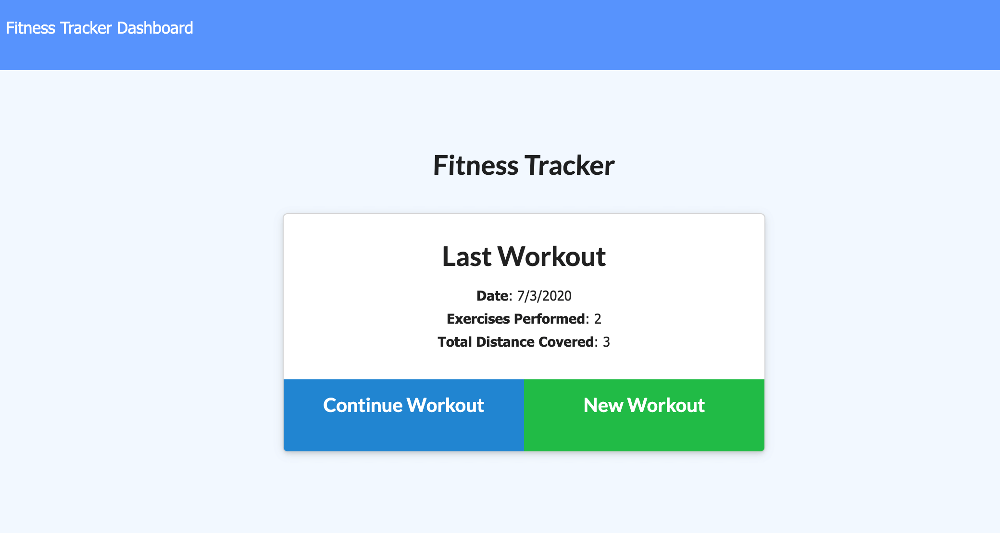
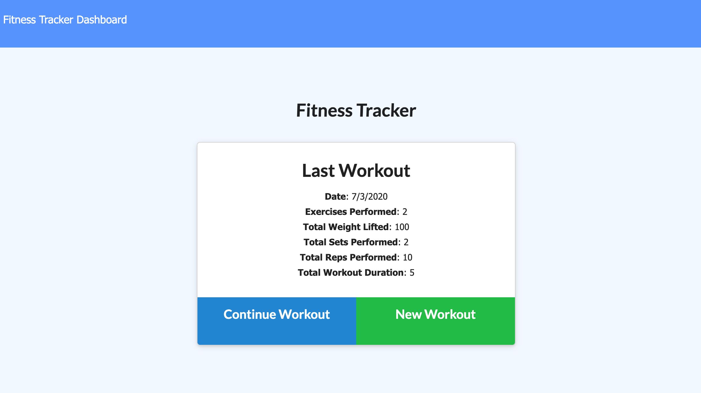
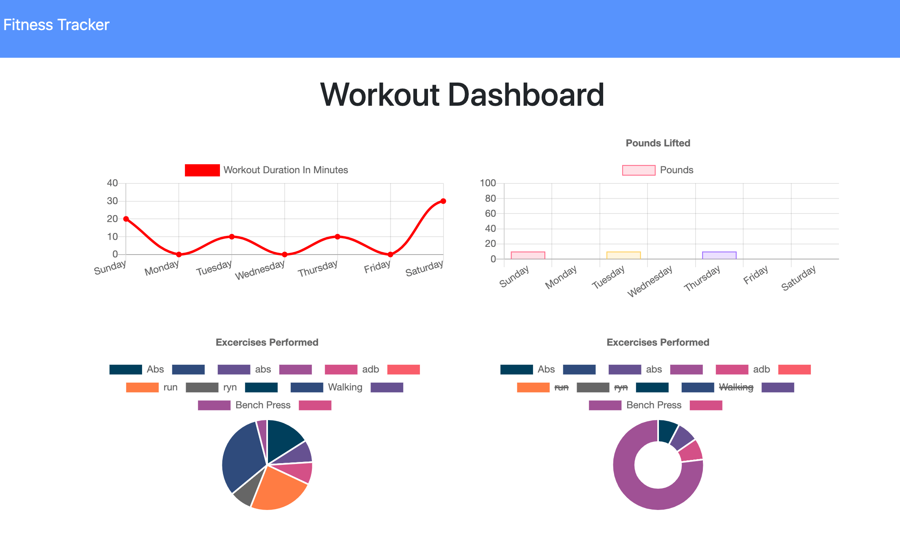

# [Workout-tracker](https://sd-workout-tracker.herokuapp.com/)

## Description
Workout Tracker is a full-stack application that allows the user to track and visualize their fitness progress. 
User is able to view create and track daily workouts. User also can add to or view their latest workout, or start a new workout where 
they can enter information about the exercises they completed. Dashboard helps to track user's daily fitness progress via charts showing 
exersises performed and duration.

 

 

## Table of Contents
* [Technologies](#technologies)
* [Usage](#usage)
* [Finished Product](#finished-product)
* [Directions for Future Development](#Directions-for-future-Development)
* [Questions](#questions)

## Technologies
* HTML
* CSS
* JavaScript
* Node.js
* Express.js
* MongoDB
* Mongoose
* Chart.js

## Usage
* Navigate to the [deployed Heroku App](https://sd-workout-tracker.herokuapp.com/).
* Home page presents the last user's workout. They can choose to contiue this workout by clicking "Continue Workout" 
to add another exercise or to begin a new one by clicking the "New Workout" button.
* Select an exercise type: Cardio or Resistance.
* Fill out exercise info fields (name, miles, distance, weight, reps, etc.)
* Choose to complete the workout or add another exercise. 
* Once workout is complete the user selects "Complete". Then they are taken back to the home screen where they 
can view their last workout information.
* Navigate to the dashboard page to view charts representing their workout progress.

## Finished Product
View deployed Heroku app [here](https://sd-workout-tracker.herokuapp.com/).  
View a video of the full application [here](https://drive.google.com/file/d/1XqTCC55GbH0I114fKOVrqhTVmMhPOKVF/view). 

## Directions for Future Development
* Revisit page styling.
* Revisit and update front-end as it was given for this project.
* 

## Questions
​If you have any questions about the repo, please contact me:

On GitHub: [Svetlana Demkovich](https://github.com/sdemkovich)